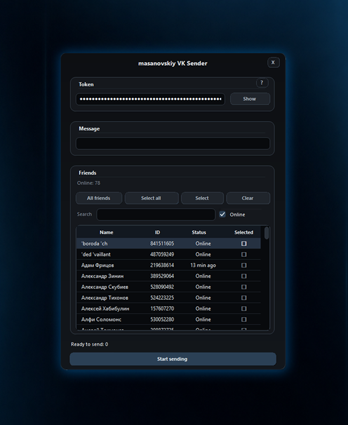

VK Message Sender is a lightweight Windows desktop tool for sending personalized VK messages to selected friends.

It includes token-based authorization, friend filtering, online-status display, recipient selection, and a clean dark interface.

## Features

- VK token authorization
- Automatic token extraction from a pasted redirect URL
- Friend IDs and online statuses
- Search and online-only filtering
- Recipient selection
- Personalized messages

## Screenshot

  

## Note

Use responsibly and only message people who expect to hear from you.
